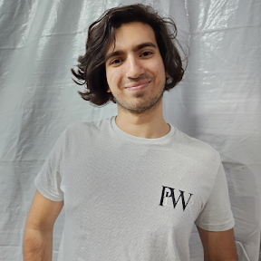

# minhabio-gcc259

# Informações pessoais

## Foto

## Nome
Felipe de Oliveira Fernandes
## Idade
21 anos
## Formação
* Curso técnico de informática pelo CEFET-MG Unidade Varginha
  * Início: 2017
  * Conclusão: 2019
 
* Bacharelado em ciências da computação pela Universidade Federal de Lavras
  * Início: 2020/1
  * Cursando atualmente

## Experiência
* Estágio em desenvolvimento **Laravel**
  * Início: Abril de 2019
  * Fím: Outubro de 2019
  * Empresa: *ADITHO*

* Estágio em desenvolvimento **vb .net**
  * Início: Outubro de 2020
  * Fím: Janeiro de 2023
  * Empresa: *CAS Empreendimentos*
 
* Estágio em desenvolvimento **javascript** e **typescript**
  * Início: Janeiro de 2023
  * Atualmente
  * Empresa: *SYDLE*
  

# Linkedin
  [Felipe de Oliveira Fernandes](https://www.linkedin.com/in/felipe-fernandes-5230a9209/)
